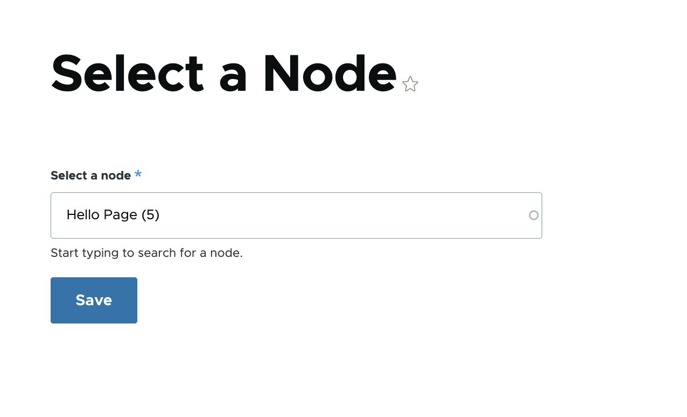
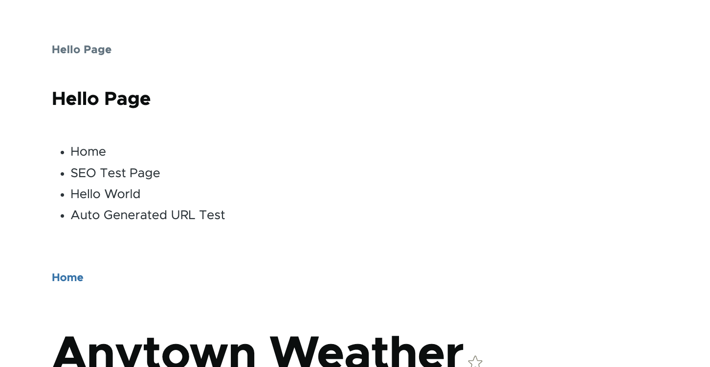

# Custom Modules

This directory contains the custom Drupal modules used in this project.

Modules included:

- **anytown**: A demo module showing a service, dependency injection, hooks and a controller that fetches weather data.
- **hello_world**: A minimal example module that provides a simple route, controller, block, and an admin settings form to set a name shown in the block.
- **movie_directory**: A custom module that integrates with a movie API to display a movie listing. It includes a service `MovieApiConnector`, a controller for the listing page, an admin configuration form for the API base URL and API key, and Twig templates for the listing and movie cards.

Quick overview:

- anytown
  - Provides a weather forecast page built around a custom `ForecastClient` service.
  - Demonstrates service registration, dependency injection, and use of hooks.
  - Files: `anytown.info.yml`, `anytown.routing.yml`, `anytown.links.menu.yml`, `anytown.services.yml`, `src/ForecastClient.php`, `src/ForecastClientInterface.php`, `src/Controller/WeatherController.php`, `src/Hook/AnytownTheme.php`, `src/Hook/FormHooks.php`, `templates/weather-page.html.twig`, plus associated CSS/JS assets.

- hello_world
  - Provides a simple page and a block that displays a greeting using the configured name.
  - Files: `hello_world.info.yml`, `hello_world.routing.yml`, `hello_world.links.menu.yml`, `src/Controller/HelloController.php`, `src/Form/HelloSettingsForm.php`, `src/Plugin/Block/HelloBlock.php`.

- movie_directory
  - Integrates with an external movie API, stores API configuration via an admin form, and renders a movie listing page with a set of cards.
  - Files: `movie_directory.info.yml`, `movie_directory.routing.yml`, `movie_directory.services.yml`, `movie_directory.module`, `src/MovieApiConnector.php`, `src/Controller/MovieListingController.php`, `src/Form/MovieApi.php`, `templates/movie-listing.html.twig`, `templates/movie-card.html.twig`, `assets/css/movie-styles.css`.

---

## hello_world

- Purpose: A minimal example module that demonstrates common Drupal extension points: a route/controller, a configurable admin form, and a block plugin.
- Key functionality:
  - Provides an admin settings form where an administrator can enter a name to be used by the module.
  - Exposes a simple page (via a controller) that can display content or links related to the module.
  - Provides a block plugin that reads the configured name and renders a greeting (for example, "Hello, ansar!").
- Main files and roles:
  - `hello_world.info.yml`: Module metadata used by Drupal.
  - `hello_world.routing.yml`: Declares any custom routes (pages) the module provides.
  - `hello_world.links.menu.yml`: Optionally adds menu links for the admin or site menus.
  - `src/Controller/HelloController.php`: Controller for the module's page routes.
  - `src/Form/HelloSettingsForm.php`: Configuration form that saves the greeting name to configuration storage.
  - `src/Plugin/Block/HelloBlock.php`: Block plugin that displays the stored name in a themed block.
- Usage:
  1. Enable the module: `drush en hello_world -y` or use the Extend UI.
  2. Visit Administration → Configuration → Hello World Settings to enter the name.
  3. Place the "Hello block" in a region through the Block Layout UI or visit the module's page route.

---

## movie_directory

- Purpose: Integrates with an external movie API to fetch and display movies in a styled listing.
- Key functionality:
  - Provides an admin configuration form to set the API base URL and API key.
  - Implements a service (`MovieApiConnector`) responsible for making HTTP requests to the remote movie API and returning parsed results.
  - Offers a controller (`MovieListingController`) which uses the service to fetch movies and passes data to Twig templates.
  - Contains Twig templates to render a responsive movie grid and individual movie cards.
  - Includes CSS in `assets/css/movie-styles.css` for card layout and styling.
- Main files and roles:
  - `movie_directory.info.yml`: Module metadata.
  - `movie_directory.routing.yml`: Defines the public route for the movie listing page.
  - `movie_directory.services.yml`: Registers the `MovieApiConnector` service and any other services.
  - `movie_directory.module`: Module hooks (if any) and lightweight integration code.
  - `src/MovieApiConnector.php`: Service that handles API requests and error handling.
  - `src/Controller/MovieListingController.php`: Controller that prepares data for the listing page.
  - `src/Form/MovieApi.php`: Admin form that stores `api_base_url` and `api_key` in configuration.
  - `templates/movie-listing.html.twig`: Page template for the full listing.
  - `templates/movie-card.html.twig`: Template for individual movie cards used by the listing.
  - `assets/css/movie-styles.css`: Styles for the movie grid and cards.
- Usage:
  1. Enable the module: `drush en movie_directory -y` or use the Extend UI.
  2. Visit Administration → Configuration → Movie API Configuration and provide your API base URL and API key.
  3. Visit the movie listing route (as defined in `movie_directory.routing.yml`) to see results.

---

## Screenshots

1. Hello World settings form
   

2. Hello World page and block
   

3. Movie listing page (grid)
   

4. Movie API Configuration form
   

---

## Usage (Quick Commands)

Enable both modules with Drush:

```bash
drush en hello_world movie_directory -y
```

Configure the modules via the administration UI:

- `Administration → Configuration → Hello World Settings` — set the greeting name.
- `Administration → Configuration → Movie API Configuration` — set the API base URL and API key.

---

## Day 2 — Routes, Controllers, Services & Dependency Injection

### How do you control or sort the menus?

Use `weight` in `MODULE_NAME.links.menu.yml`. Lower number = appears first, higher number = appears last.

```yaml
hello_world.admin:
  title: 'Hello module settings'
  parent: system.admin_config_development
  route_name: hello_world.content
  weight: 10 # appears before weight: 100
```

### How do you setup child menus?

Use `parent` and point it to the route name of the parent menu item.

```yaml
# Parent item
hello_world.admin:
  title: 'My Module'
  parent: system.admin_config
  route_name: system.admin_config_helloworld
  weight: 10

# Child item — points to parent above
hello_world.admin_settings:
  title: 'Settings'
  parent: system.admin_config_helloworld
  route_name: hello_world.content
  weight: 10
```

### How do you retrieve a query string in a Controller?

A query string is the `?key=value` part of a URL — not to confuse with a route parameter like `{id}`.

```
/movies?genre=action    → query string
/movies/42              → route parameter
```

```php
// URL: /movies?genre=action&year=2024
public function list() {
  $genre = \Drupal::request()->query->get('genre'); // "action"
  $year  = \Drupal::request()->query->get('year');  // "2024"
}
```

### What is Guzzle and Logger?

**Guzzle** is a PHP HTTP client — like `fetch()` in JavaScript. It lets you make HTTP requests to external APIs.

```php
// Make a GET request to an external API
$response = $this->httpClient->get('https://api.example.com/movies');
$data = json_decode($response->getBody()->getContents(), true);
```

**Logger** is Drupal's logging service. It lets you log messages from your module to the Drupal watchdog log, grouped by channel (module name).

```php
$this->logger->info('Page visited by @user', ['@user' => $name]);
$this->logger->error('API call failed: @msg', ['@msg' => $e->getMessage()]);
```

### Use Logger to log a message — where do messages appear?

```php
public function __construct(ClientInterface $httpClient, LoggerChannelFactoryInterface $logger_factory) {
    $this->httpClient = $httpClient;
    $this->logger = $logger_factory->get('anytown');
  }

...

public function getForecastData(string $url) : ?array {
    try {
      $response = $this->httpClient->request('GET', $url);
      $json = json_decode($response->getBody()->getContents());
    }
    catch (GuzzleException $e) {
      $this->logger->warning($e->getMessage());
      return NULL;
    }
    ....
}
```

Messages appear at: **Administration → Reports → Recent log messages**
(`/admin/reports/dblog`)

Filter by type `anytown` to see only your module's messages.

### Where can you find the services defined by Drupal core?

```
web/core/core.services.yml
```

This file lists all services Drupal core provides: `logger.factory`, `http_client`, `database`, `current_user`, `path_alias.manager`, and many more.

### How do you inject other needed services into your service?

Three ways, ranked best to avoid:

**1. AutowireTrait (recommended for Drupal 10/11)**

```php
use Drupal\Core\DependencyInjection\AutowireTrait;
use GuzzleHttp\ClientInterface;

class MyService {
  use AutowireTrait;

  public function __construct(
    private readonly ClientInterface $httpClient
  ) {}
}
```

**2. `create()` factory method (older, still valid)**

```php
public static function create(ContainerInterface $container) {
  return new static(
    $container->get('http_client'),
    $container->get('logger.factory')
  );
}

public function __construct($httpClient, $loggerFactory) {
  $this->httpClient = $httpClient;
  $this->logger = $loggerFactory->get('my_module');
}
```

**3. `services.yml` (for registering custom services)**

```yaml
# my_module.services.yml
services:
  my_module.my_service:
    class: Drupal\my_module\MyService
    arguments: ['@http_client', '@logger.factory']
```

### How do you return a Twig template in a Controller?

Three steps:

**Step 1 — Register the theme hook in `.module`:**

```php
// my_module.module
function my_module_theme() {
  return [
    'weather_forecast' => [
      'variables' => [
        'temperature' => NULL,
        'description' => NULL,
      ],
    ],
  ];
}
```

**Step 2 — Return render array with `#theme` in Controller:**

```php
public function content(): array {
  return [
    '#theme' => 'weather_forecast',
    '#temperature' => '25°C',
    '#description' => 'Sunny',
  ];
}
```

**Step 3 — Create Twig template:**

```twig
{# templates/weather-forecast.html.twig #}
<div class="weather">
  <p>{{ description }}</p>
  <p>Temperature: {{ temperature }}</p>
</div>
```

Rule: hook name uses `underscores` → filename uses `dashes` (`weather-forecast.html.twig`).

### How would you add an external JS to your module?

In `MODULE_NAME.libraries.yml`, use `type: external`:

```yaml
# anytown.libraries.yml
anytown-styles:
  js:
    https://unpkg.com/@tailwindcss/browser@4: { type: external }
  dependencies:
    - core/drupal
```

Then attach in your render array:

```php
return [
  '#theme' => 'weather_forecast',
  '#attached' => [
    'library' => ['anytown/anytown-styles'],
  ],
];
```

### Translation search keyword for `$this->t('Hello, @name!', ['@name' => $username])`

Search for the string **with the placeholder**, not the actual value:

```
Hello, @name!
```

Go to `/admin/config/regional/translate` and search `Hello, @name!` — Drupal stores the original string with the placeholder.

### How do you make a string translatable in Drupal JavaScript files?

Use `Drupal.t()` — the JavaScript equivalent of `$this->t()`:

```javascript
// Simple string
Drupal.t('Hello World');

// With placeholder
Drupal.t('Hello, @name!', { '@name': username });
```

Make sure your library has `core/drupal` as a dependency so `Drupal.t()` is available:

```yaml
my-library:
  js:
    js/my-script.js: {}
  dependencies:
    - core/drupal
```

### Use `drush php` to get the path alias of `node/1`

```bash
ddev drush php
```

Then inside the drush console:

```php
$alias_manager = \Drupal::service('path_alias.manager');
$alias = $alias_manager->getAliasByPath('/node/1');
echo $alias;
// Output: /my-page-alias  (or /node/1 if no alias is set)
```

**Get full URL of a route using `Link` and `Url`:**

```php
use Drupal\Core\Url;
use Drupal\Core\Link;

// Get URL object from route name
$url = Url::fromRoute('hello_world.content');

// Get the full URL string
$full_url = $url->setAbsolute(true)->toString();
echo $full_url;
// Output: https://drupal-custom-module.ddev.site/hello

// Create a clickable link
$link = Link::fromTextAndUrl('Go to Hello page', $url);
$renderable = $link->toRenderable();
```

### How do you send a JSON response in a Controller?

Use `JsonResponse` from Symfony — it automatically sets the `Content-Type: application/json` header:

```php
use Symfony\Component\HttpFoundation\JsonResponse;

public function apiData(): JsonResponse {
  $data = [
    'status' => 'ok',
    'movies' => [
      ['id' => 1, 'title' => 'Inception'],
      ['id' => 2, 'title' => 'Interstellar'],
    ],
  ];

  return new JsonResponse($data);
  // Automatically sets: Content-Type: application/json
  // Status code: 200 by default
}

// With custom status code
return new JsonResponse(['error' => 'Not found'], 404);
```

---

# Day 3 : Hooks

### What are hooks?

Hooks are **functions that run automatically to change or extend Drupal's behaviour**, and they have 3 types:

- **Registration hooks** : declare something exists (`hook_theme`, `hook_permission`)
- **Event hooks** : react to something that happened (`hook_user_login`, `hook_node_insert`)
- **Alter hooks** : intercept and modify data (`hook_form_alter`, `hook_preprocess_block`)

Two ways to implement in Drupal 11:

```php
// Modern way : OOP class in src/Hook/
#[Hook('form_alter')]
public function formAlter(array &$form, FormStateInterface $form_state, string $form_id): void {
  // logic here
}

// Old way : global function in .module file
function mymodule_form_alter(&$form, $form_state, $form_id) {
  // logic here
}
```

### What hooks does the `metatag` module provide?

Found in `web/modules/contrib/metatag/metatag.api.php`:

- `hook_metatag_route_entity` : tells metatag which entity to load tags from on a custom route
- `hook_metatags_attachments_alter` : modify metatags just before they are added to the page
- `hook_metatag_migrate_metatagd7_tags_map_alter` : used during migration from Drupal 7
- `hook_metatag_migrate_nodewordsd6_tags_map_alter` : used during migration from Drupal 6

### Which hook is responsible for altering a form?

`hook_form_alter` receives 3 arguments:

- `&$form` : the form array, passed by reference, modify directly
- `$form_state` : current state of the form
- `$form_id` : unique ID of the form being built

```php
// src/Hook/FormHooks.php
#[Hook('form_alter')]
public function formAlter(array &$form, FormStateInterface $form_state, string $form_id): void {
  if ($form_id === 'movie_api_config_page') {
    $form['my_custom_field'] = [
      '#type' => 'textfield',
      '#title' => 'My Custom Field',
      '#description' => 'Added by anytown module',
      '#weight' => 99,
    ];
  }
}
```

To find any form's ID temporarily add inside `formAlter`:

```php
\Drupal::messenger()->addMessage('Form ID: ' . $form_id);
```

### Using `isFrontPage` and a preprocess hook to pass `is_front` to Twig

`hook_preprocess_page` runs before `page.html.twig` renders : variables you add here become available in the template.

```php
// src/Hook/ThemeHooks.php
#[Hook('preprocess_page')]
public function preprocessPage(array &$variables): void {
  $variables['is_front'] = \Drupal::service('path.matcher')->isFrontPage();
}
```

Confirm it works temporarily:

```php
\Drupal::messenger()->addMessage('is_front = ' . ($variables['is_front'] ? 'TRUE' : 'FALSE'));
```

Use in Twig:

```twig

  <div class="hero-banner">Welcome!</div>

```

### Use `hook_page_attachments_alter` to add a viewport metatag

```php
// src/Hook/ThemeHooks.php
#[Hook('page_attachments_alter')]
public function pageAttachmentsAlter(array &$attachments): void {
  $attachments['#attached']['html_head'][] = [
    [
      '#tag' => 'meta',
      '#attributes' => [
        'name' => 'viewport',
        'content' => 'width=device-width, initial-scale=1, shrink-to-fit=no',
      ],
    ],
    'viewport',  // unique key : like an id, prevents duplicate tags
  ];
}
```

Verify : right click any page → View Page Source → search `viewport`.

### Use `hook_preprocess_menu` to add a CSS class to all menu items

```php
// src/Hook/ThemeHooks.php
#[Hook('preprocess_menu')]
public function preprocessMenu(array &$variables): void {
  foreach ($variables['items'] as &$item) {
    // $item['attributes'] is an Attribute object : use ->addClass() not array syntax
    $item['attributes']->addClass('my-custom-class');
  }
}
```

Verify by inspecting any menu `<li>` in browser dev tools.

### Use `hook_preprocess_block` to alter the `system_branding_block`

```php
// src/Hook/ThemeHooks.php
#[Hook('preprocess_block')]
public function preprocessBlock(array &$variables): void {
  if ($variables['plugin_id'] === 'system_branding_block') {
    $variables['site_logo'] = 'https://static.cdnlogo.com/logos/d/88/drupal-wordmark.svg';
  }
}
```

To find the `plugin_id` of any block, temporarily log all IDs:

```php
\Drupal::messenger()->addMessage('plugin_id: ' . $variables['plugin_id']);
```

This lists every block plugin ID when visiting a page : find the one you need and target it.

# Day 4 : Plugins & Forms

### What are Plugins?

Plugins are **reusable, swappable OOP classes** that implement a defined interface. Unlike hooks which are just functions, plugins are full classes.

```
Hooks   : functions Drupal calls automatically by naming convention
Plugins : classes that implement a specific interface, discovered by attributes
```

Plugin types in Drupal :

```
src/Plugin/
  ├── Block/          : block plugins
  ├── Field/
  │   ├── Formatter/  : how a field displays
  │   └── Widget/     : how a field is edited
  ├── QueueWorker/    : background processing
  └── Action/         : bulk operations
```

A module is the package. Inside it you can have hooks, services, plugins, controllers and forms :

```
Module (hello_world/)
  ├── Hooks       : src/Hook/        — functions Drupal calls automatically
  ├── Plugins     : src/Plugin/      — swappable OOP pieces (Block etc)
  ├── Services    : src/             — reusable business logic
  ├── Controllers : src/Controller/  — handle page requests
  └── Forms       : src/Form/        — handle form build/validate/submit
```

### Service : the middle layer

```
Controller  →  Service  →  External API / Database
```

Each layer has one job :

```
Controller : handle the request, return a response
Service    : business logic, data fetching, processing
API/DB     : the actual data source
```

Services can be reused anywhere :

```
Controller  ──→ Service ──→ API
Block       ──→ Service ──→ API
Hook        ──→ Service ──→ API
```

### Dependency Injection in Plugins (Blocks)

Blocks extend `BlockBase` — cannot use `AutowireTrait`. Must use `create()` manually:

```php
#[Block(
  id: "hello_block",
  admin_label: new TranslatableMarkup("Hello block"),
  category: new TranslatableMarkup("Custom")
)]
class HelloBlock extends BlockBase implements ContainerFactoryPluginInterface {

  /** @var \Drupal\Core\Session\AccountProxyInterface */
  private $currentUser;
  /** @var \Drupal\Core\Config\ConfigFactoryInterface */
  private $configFactory;

  public function __construct(
    array $configuration,
    $plugin_id,
    $plugin_definition,
    AccountProxyInterface $current_user,
    ConfigFactoryInterface $config_factory
  ) {
    parent::__construct($configuration, $plugin_id, $plugin_definition);
    $this->currentUser = $current_user;
    $this->configFactory = $config_factory;
  }

  public function build(): array {
    $config = $this->configFactory->get(HelloSettingsForm::HELLO_WORLD_SETTINGS);

    return [
      '#markup' => $this->t('Hello, @name!', [
        '@name' => $config->get('hello.name') ?: $this->currentUser->getDisplayName() ?: 'Stranger',
      ]),
      '#cache' => [
        'tags' => $config->getCacheTags(),  // invalidate when config changes
        'contexts' => ['user'],             // separate cache per user
      ],
    ];
  }

  public static function create($container, array $configuration, $plugin_id, $plugin_definition): static {
    return new static(
      $configuration,
      $plugin_id,
      $plugin_definition,
      $container->get('current_user'),
      $container->get('config.factory'),
    );
  }
}
```

Note : `$configuration` in plugins is NOT the Drupal config system. It is the block instance data (region, label etc) set by Drupal internally.

### Cache tags and contexts

```php
'#cache' => [
  'tags' => $config->getCacheTags(),  // WHEN to invalidate (config changes)
  'contexts' => ['user'],             // FOR WHOM to cache separately
  'max-age' => 0,                     // HOW LONG — 0 = never cache (dev only!)
],
```

Cache contexts :

```php
'contexts' => ['user']           // separate cache per user
'contexts' => ['user.roles']     // separate cache per role
'contexts' => ['url']            // separate cache per URL
'contexts' => ['languages']      // separate cache per language
```

### ConfigFactory vs ImmutableConfig

```
ConfigFactoryInterface  : the factory SERVICE — injected via DI
ImmutableConfig         : the config OBJECT returned by the factory — read only
```

```php
// Inject the factory
public function __construct(ConfigFactoryInterface $configFactory) {
  $this->configFactory = $configFactory;
}

// Use factory to get ImmutableConfig (read only)
$config = $this->configFactory->get('hello_world.settings');
$config->get('hello.name');        // read value ✅
$config->set('hello.name', '...')  // error! immutable ❌

// Use getEditable() to write
$this->configFactory->getEditable('hello_world.settings')
  ->set('hello.name', 'Ansar')
  ->save();
```

### State API vs Config API vs Config Entities

|                   | State          | Config          | Config Entity               |
| ----------------- | -------------- | --------------- | --------------------------- |
| Exportable        | No             | Yes             | Yes                         |
| Travels with code | No             | Yes             | Yes                         |
| Use for           | runtime data   | module settings | Views, Roles, Content types |
| Example           | last cron time | site name       | Views, Roles                |

```php
// State API : simple key-value, not exportable
$this->state->set('movie_directory.settings', $values);
$this->state->get('movie_directory.settings');

// Config API : exportable to config/sync as YAML
$this->configFactory->getEditable('mymodule.settings')
  ->set('api_url', $value)
  ->save();
```

Rule :

```
Admin settings that move between environments  : Config API
Runtime/temporary data                         : State API
Sensitive data (API keys, passwords)           : environment variables
```

### Where can you validate form data?

**Primary place : `validateForm()` in the form class:**

```php
// hello_world module
public function validateForm(array &$form, FormStateInterface $form_state): void {
  $name = $form_state->getValue('name');
  if (strlen($name) > 50 || strlen($name) < 3) {
    $form_state->setErrorByName('name', $this->t('Name cannot be longer than 50 or less than 3 characters.'));
  }
  parent::validateForm($form, $form_state);
}

// movie_directory module
public function validateForm(array &$form, FormStateInterface $form_state): void {
  $api_base_url = $form_state->getValue('api_base_url');
  if (!filter_var($api_base_url, FILTER_VALIDATE_URL)) {
    $form_state->setErrorByName('api_base_url', $this->t('The API Base URL must be a valid URL.'));
  }

  $api_key = $form_state->getValue('api_key');
  if (empty($api_key)) {
    $form_state->setErrorByName('api_key', $this->t('The API Key cannot be empty.'));
  }

  parent::validateForm($form, $form_state);
}

// anytown module
public function validateForm(array &$form, FormStateInterface $form_state): void {
  $location = $form_state->getValue('location');
  $value = filter_var($location, FILTER_VALIDATE_INT);
  if (!$value || strlen((string) $location) !== 5) {
    $form_state->setErrorByName('location', $this->t('Location must be exactly 5 numbers.'));
  }

  parent::validateForm($form, $form_state);
}
```

**+1 : Also via `hook_form_alter` for forms you don't own:**

```php
#[Hook('form_alter')]
public function formAlter(array &$form, FormStateInterface $form_state, string $form_id): void {
  if ($form_id === 'user_register_form') {
    $form['#validate'][] = 'mymodule_extra_validate';
  }
}

function mymodule_extra_validate(array &$form, FormStateInterface $form_state): void {
  $email = $form_state->getValue('email');
  if (!filter_var($email, FILTER_VALIDATE_EMAIL)) {
    $form_state->setErrorByName('email', t('Invalid email.'));
  }
}
```

Rule :

```
Your own form       : validateForm() in the form class
Someone else's form : hook_form_alter() + custom validator
```

### How to render a Form inside a Block

`ControllerBase` provides `formBuilder()` shortcut for free :

```php
class MyFormBlock extends BlockBase implements ContainerFactoryPluginInterface {

  public function build(): array {
    return $this->formBuilder()->getForm('\Drupal\mymodule\Form\MyCustomForm');
  }

}
```

### How to redirect after form submit and show a message

```php
public function submitForm(array &$form, FormStateInterface $form_state): void {

  // Green success message
  $this->messenger()->addStatus($this->t('Settings saved successfully.'));

  // Redirect to a route
  $form_state->setRedirect('hello_world.content');

  // Or redirect to a URL
  $form_state->setRedirectUrl(Url::fromUri('internal:/weather'));
}
```

Messenger methods :

```php
$this->messenger()->addStatus(...)   // green : success
$this->messenger()->addWarning(...)  // yellow : warning
$this->messenger()->addError(...)    // red : error
```

### Hide a field for anonymous users using `#access`

```php
$form['secret_field'] = [
  '#type' => 'textfield',
  '#title' => $this->t('Secret Field'),
  '#access' => \Drupal::currentUser()->isAuthenticated(),
  // logged in  : TRUE  : visible
  // anonymous  : FALSE : hidden
];
```

Other access examples :

```php
// Only admins
'#access' => \Drupal::currentUser()->hasPermission('administer site configuration'),

// Only editors
'#access' => in_array('editor', \Drupal::currentUser()->getRoles()),
```

`#access => FALSE` vs `unset()` :

```php
$form['field']['#access'] = FALSE;  // hidden but still secure — Drupal validates server side ✅
unset($form['field']);              // completely removed from form ✅
```

### How to group fields together

Use `#type : fieldset` or `#type : details` :

```php
// Fieldset : simple grouping (not collapsible)
$form['personal'] = [
  '#type' => 'fieldset',
  '#title' => $this->t('Personal Information'),
];

$form['personal']['name'] = [
  '#type' => 'textfield',
  '#title' => $this->t('Name'),
];

// Details : collapsible group (closest to field_group module)
$form['address'] = [
  '#type' => 'details',
  '#title' => $this->t('Address'),
  '#open' => TRUE,  // expanded by default
];

$form['address']['street'] = [
  '#type' => 'textfield',
  '#title' => $this->t('Street'),
];
```

### hook_form_alter variants

```php
// Runs for ALL forms
#[Hook('form_alter')]
public function formAlter(array &$form, FormStateInterface $form_state, string $form_id): void {
  if ($form_id === 'user_register_form') {
    $form['phone'] = ['#type' => 'tel', '#title' => 'Phone'];
  }
}

// Runs ONLY for user_register_form
#[Hook('form_user_register_form_alter')]
public function formUserRegisterFormAlter(array &$form, FormStateInterface $form_state): void {
  $form['phone'] = ['#type' => 'tel', '#title' => 'Phone'];
}
```

How to find a form ID :

```php
// 1. Check getFormId() in the form class
public function getFormId() { return 'user_register_form'; }

// 2. Inspect HTML — dashes in HTML = underscores in PHP
<form id="user-register-form">

// 3. Temporarily dump it
\Drupal::messenger()->addMessage('Form ID: ' . $form_id);
```

### Form structure best practices

```php
// actions container — correct way to add buttons
$form['actions']['#type'] = 'actions';
$form['actions']['submit'] = [
  '#type' => 'submit',
  '#value' => $this->t('Save'),
  '#button_type' => 'primary',
];
```

`#type : actions` wraps buttons in `<div class="form-actions">` for proper theme styling and always places them at the bottom.

### return $form vs return parent::buildForm()

```php
// return $form : returns only what you built
return $form;

// return parent::buildForm() : adds form_token, form_id, form_build_id
return parent::buildForm($form, $form_state);
```

Rule :

```
extends FormBase        : return $form (fine)
extends ConfigFormBase  : return parent::buildForm() (required)
```

### $form passed by reference

```php
// & means by reference — changes to $form persist
public function formAlter(array &$form, ...) {
  $form['new_field'] = [...];  // modifies the original ✅
}

// Without & — changes are lost
public function formAlter(array $form, ...) {
  $form['new_field'] = [...];  // modifies a copy, lost ❌
}
```

`buildForm` is the only form method WITHOUT `&` because it returns the form instead of modifying in place.

# Day 5 : Data Types, Entities & Queries

### Config vs State vs Entity System

```
Config  : "how the site is configured"
          exportable, travels between environments
          example : site name, API keys, module settings

State   : "what the site is currently doing"
          temporary runtime data, stays per environment
          example : last cron run time, temporary flags

Entity  : "what content the site has" — Drupal's ORM
          example : nodes, users, comments, taxonomy terms
```

### Config API : Simple vs Config Entities

```
Simple Configuration :
  one set of settings per site
  ├── site name
  ├── API keys
  ├── module on/off settings
  └── hello_world.settings (hello.name)

Configuration Entities :
  multiple instances of the same type
  ├── Content types (article, page, blog...)
  ├── Views (frontpage, user_list, search...)
  ├── Image styles (thumbnail, medium, large...)
  └── Vocabularies (tags, categories...)
```

### Reading and writing config

```php
// READ ONLY — ImmutableConfig
$config = \Drupal::config('anytown.settings');
$location = $config->get('location');

// READ AND WRITE — mutable Config
$config = $this->configFactory->getEditable('anytown.settings');
$config->set('location', '90210')->save();
```

Rule:

```
Admin settings that move between environments  : Config API
Runtime/temporary data                         : State API
Sensitive data (API keys, passwords)           : environment variables
```

### Use `drush php` to dump `eu_cookie_compliance` config

```bash
ddev drush php
```

```php
$config = \Drupal::config('eu_cookie_compliance.settings');
print_r($config->getRawData());
```

Returns all active config values from the database:

```
popup_enabled              : 1
popup_agree_button_message : "Accept"
popup_info                 : ["value" => "<h2>We use cookies...</h2>", "format" => "full_html"]
consent_storage_method     : "do_not_store"
langcode                   : "en"
```

Note : `drush php` is a PHP console — bash commands like `find` don't work inside it. Exit first with `exit` then run bash commands in the terminal.

### Where is the config file for `eu_cookie_compliance` located?

```bash
find web -name "eu_cookie_compliance.settings.yml"
```

Two locations:

```
# Default config shipped with the module (read only)
web/modules/contrib/eu_cookie_compliance/config/install/eu_cookie_compliance.settings.yml

# Your site's exported active config
web/config/sync/eu_cookie_compliance.settings.yml
```

### Why do we need a `schema.yml` file?

`schema.yml` tells Drupal the **structure and data types** of your config — like a TypeScript interface for your config object.

```yaml
# anytown.schema.yml
anytown.settings:
  type: config_object
  label: 'Anytown settings'
  mapping:
    location:
      type: string # zip code — not translatable
      label: 'Location'
    display_forecast:
      type: boolean # true/false — not translatable
      label: 'Display forecast'
    weather_closures:
      type: text # shown to users — translatable ✅
      label: 'Weather closures'
```

4 reasons you need it:

```
1. Type casting    : display_forecast returns TRUE/FALSE not "1"/"0"
2. Translation     : type: text/label values appear in translation UI
3. Config deploy   : drush cim/cex validates values against schema
4. Config inspector: admin/config/development/configuration/inspect shows green
```

Type reference:

```
type: string   : plain value, NOT translatable
type: boolean  : true/false, NOT translatable
type: integer  : number, NOT translatable
type: text     : long text shown to users, TRANSLATABLE ✅
type: label    : short text shown to users, TRANSLATABLE ✅
```

Location : `web/modules/custom/anytown/config/schema/anytown.schema.yml`

### How do you load a node?

```php
// Load single node by ID
$node = \Drupal::entityTypeManager()
  ->getStorage('node')
  ->load(1);

// Get field values
$title = $node->getTitle();
$body  = $node->get('body')->value;
$field = $node->get('field_my_field')->value;

// Entity reference field — get the referenced entity
$referenced = $node->get('field_ref')->entity;

// Update a field and save
$node->set('title', 'New Title');
$node->set('field_my_field', 'new value');
$node->save();
```

Useful node methods:

```php
$node->getType()       // content type : "article"
$node->getTitle()      // title        : "My Article"
$node->label()         // same as getTitle() for nodes
$node->id()            // node ID      : 42
$node->isPublished()   // published?   : TRUE/FALSE
$node->getOwnerId()    // author ID    : 5
```

### What is a Constraint?

A Constraint is a **validation rule** attached to a field or entity — runs automatically when you validate or save an entity:

```php
$node->set('field_url', 'not-a-url');
$violations = $node->validate();

if ($violations->count() > 0) {
  foreach ($violations as $violation) {
    echo $violation->getMessage();
  }
}
```

Built-in constraints:

```
NotNull      : field cannot be empty
Length       : min/max string length
Url          : must be valid URL
UniqueField  : value must be unique across all nodes
Range        : numeric min/max value
```

Difference from `validateForm()`:

```
validateForm()  : only runs when submitting a form
Constraint      : runs whenever the entity is validated
                  whether via form OR programmatic save
```

### What are View Builders and display modes?

```
View Builder  : the class that renders an entity into HTML
Display mode  : a named configuration of how fields are displayed
```

Display modes:

```
full          : complete node page
teaser        : preview card on listing pages
search_result : search results display
rss           : RSS feed display
```

```php
$view_builder = $this->entityTypeManager()->getViewBuilder('node');

// Render one node in teaser mode
$render = $view_builder->view($node, 'teaser');

// Render multiple nodes in teaser mode at once
$render = $view_builder->viewMultiple($nodes, 'teaser');

// Render a single field with options
$render = $node->get('field_vendor_contact_email')->view([
  'label' => 'hidden',  // hide the field label
]);
```

### Entity Queries : Drupal's ORM

Entity queries are like an ORM — same concept as Eloquent (Laravel):

```
Eloquent (Laravel)              Drupal Entity Query
──────────────────              ──────────────────
Article::where(...)          →  entityQuery('node')
->where('type', 'article')   →  ->condition('type', 'article')
->orderBy('created', 'desc') →  ->sort('created', 'DESC')
->take(10)                   →  ->range(0, 10)
->get()                      →  ->execute() + loadMultiple()
```

Full flow — always 2 steps:

```php
// Step 1 : fast lightweight query — get IDs only
$nids = \Drupal::entityQuery('node')
  ->accessCheck(TRUE)
  ->condition('type', 'article')
  ->condition('status', 1)
  ->sort('created', 'DESC')
  ->range(0, 10)
  ->execute();
// returns [] if nothing found — saves all further queries ✅

// Step 2 : only runs IF ids exist — load full entities
$nodes = \Drupal::entityTypeManager()
  ->getStorage('node')
  ->loadMultiple($nids);
```

Why 2 steps:

```
1. Cache        : already loaded entities come from memory — no DB query
2. Flexibility  : sometimes you only need IDs (count, exists check)
3. Architecture : fields in separate tables — no clean JOIN possible
4. Fail fast    : if step 1 returns [] → step 2 never runs → saved queries
```

Common conditions:

```php
->condition('type', 'article')                      // content type
->condition('status', 1)                            // published only
->condition('uid', 5)                               // by user ID
->condition('created', strtotime('-7 days'), '>=')  // last 7 days
->condition('nid', 42, '<>')                        // exclude node 42
->sort('created', 'DESC')                           // newest first
->range(0, 10)                                      // first 10 results
->count()->execute()                                // just the count
```

### What is the role of `accessCheck` in entity queries?

```php
// accessCheck(TRUE) — respects user permissions
// anonymous user cannot see unpublished nodes
// use for all frontend pages ✅
->accessCheck(TRUE)

// accessCheck(FALSE) — bypasses all permissions
// returns ALL nodes regardless of who is logged in
// use for cron, migrations, backend tasks ✅
->accessCheck(FALSE)

// Not passing it — deprecated in Drupal 9+, throws warning ❌
// always pass accessCheck explicitly
```

### How do you get a node translation in French?

```php
$node = \Drupal::entityTypeManager()
  ->getStorage('node')
  ->load(1);

// Check if French translation exists
if ($node->hasTranslation('fr')) {
  $french_node = $node->getTranslation('fr');
  $title = $french_node->getTitle();
  $body  = $french_node->get('body')->value;
}

// Get all available translations
$languages = $node->getTranslationLanguages();
foreach ($languages as $langcode => $language) {
  $translated = $node->getTranslation($langcode);
  echo $translated->getTitle();
}
```

### `PHP_EOL` — End Of Line

```php
// PHP_EOL = newline character (\n on Linux/Mac, \r\n on Windows)
// Use it to split textarea values into arrays

$items = explode(PHP_EOL, $settings->get('weather_closures') ?? '');
// "Monday closed\nTuesday closed" → ['Monday closed', 'Tuesday closed']

// Better than hardcoding "\n" — works on all operating systems
explode(PHP_EOL, $text)  // ✅ cross-platform
explode("\n", $text)     // ❌ Linux/Mac only
```

---

## Exercises : Node Selector Feature

Built a 3-part "Related Content" feature in the `anytown` module:

```
Exercise 1 : Form with entity_autocomplete
             admin selects a node → saved to State API

Exercise 2 : Block reads saved node ID from State
             loads node, displays title

Exercise 3 : Entity query finds related nodes
             same content type, excludes selected node
             hook_theme + Twig renders the list
```

### Exercise 1 — NodeSelectorForm

```php
// src/Form/NodeSelectorForm.php
class NodeSelectorForm extends FormBase {
  use AutowireTrait;

  const SELECTED_NODE = 'anytown.selected_node';

  public function __construct(
    StateInterface $state,
    EntityTypeManagerInterface $entityTypeManager
  ) { ... }

  public function buildForm(...): array {
    $saved_nid = $this->state->get(self::SELECTED_NODE);

    $form['node_id'] = [
      '#type' => 'entity_autocomplete',   // entity reference field
      '#target_type' => 'node',           // search nodes only
      '#title' => $this->t('Select a node'),
      '#default_value' => $saved_nid
        ? $this->entityTypeManager->getStorage('node')->load($saved_nid)
        : NULL,
    ];
  }

  public function submitForm(...): void {
    $node_id = $form_state->getValue('node_id');
    $this->state->set(self::SELECTED_NODE, $node_id);
  }
}
```

Why `#target_type` is required:

```
entity_autocomplete is generic — can reference ANY entity type
#target_type tells it which one to search:

'#target_type' => 'node'           // search nodes
'#target_type' => 'user'           // search users
'#target_type' => 'taxonomy_term'  // search terms
```

Why State and not Config:

```
Node IDs are environment-specific:
  dev  : node 5 = "Test Article"
  prod : node 5 = "Real Article" or doesn't exist!

Config travels between environments → wrong choice ❌
State stays per environment         → correct choice ✅
```

### Node Selector Form



### Exercise 2 & 3 — NodeBlock with entity query + Twig

```php
// src/Plugin/Block/NodeBlock.php
public function build(): array {
  $saved_nid = $this->state->get(NodeSelectorForm::SELECTED_NODE);
  $node = $this->entityTypeManager->getStorage('node')->load($saved_nid);

  if (!$node) {
    return ['#markup' => $this->t('No node selected.')];
  }

  // entity query : same type, exclude selected, published only
  $nids = $this->entityTypeManager->getStorage('node')->getQuery()
    ->accessCheck(TRUE)
    ->condition('type', $node->getType())   // same content type
    ->condition('nid', $saved_nid, '<>')    // exclude selected node
    ->condition('status', 1)
    ->execute();

  $related_nodes = $this->entityTypeManager->getStorage('node')->loadMultiple($nids);
  $related_titles = [];
  foreach ($related_nodes as $related) {
    $related_titles[] = $related->label();
  }

  return [
    '#theme' => 'node_block',
    '#title' => $node->label(),
    '#nodes' => $related_titles,
    '#cache' => [
      'tags' => array_merge(
        $node->getCacheTags(),  // invalidate when selected node changes
        ['node_list'],          // invalidate when any node is added/deleted
      ),
    ],
  ];
}
```

hook_theme — merged into existing `AnytownTheme.php`:

```php
// only ONE hook_theme per module — merge all into same method
#[Hook('theme')]
public function theme(): array {
  return [
    'weather_page' => [...],  // existing
    'node_block' => [
      'variables' => [
        'title' => NULL,  // no # prefix in hook_theme variables
        'nodes' => [],
      ],
    ],
  ];
}
```

Twig template `templates/node-block.html.twig`:

```twig
<div class="node-block">
  <h3>{{ title }}</h3>
  
    <ul class="node-block__related">
      
        <li>{{ node_title }}</li>
      
    </ul>
  
    <p>{{ 'No related nodes found.'|t }}</p>
  
</div>
```

### Node Block with Related Content



### Key lessons from exercises

```
hook_theme once    : only ONE hook_theme per module
                     merge all theme hooks into the same method
                     Drupal throws error if implemented more than once

# prefix           : used in render arrays (#title, #nodes)
                     NOT used in hook_theme variable definitions

node_list tag      : cache tag that invalidates when ANY node changes
                     use alongside node->getCacheTags() for related content

getType()          : returns content type string "article", "page" etc
'<>' operator      : not equal — used to exclude a node ID from query
```

### Cache tags reference

```php
// Single node cache — invalidates when THIS specific node is updated
'tags' => $node->getCacheTags()

// Node list cache — invalidates when ANY node is created/updated/deleted
'tags' => ['node_list']

// Combined — best for related content blocks ✅
'tags' => array_merge($node->getCacheTags(), ['node_list'])
```
