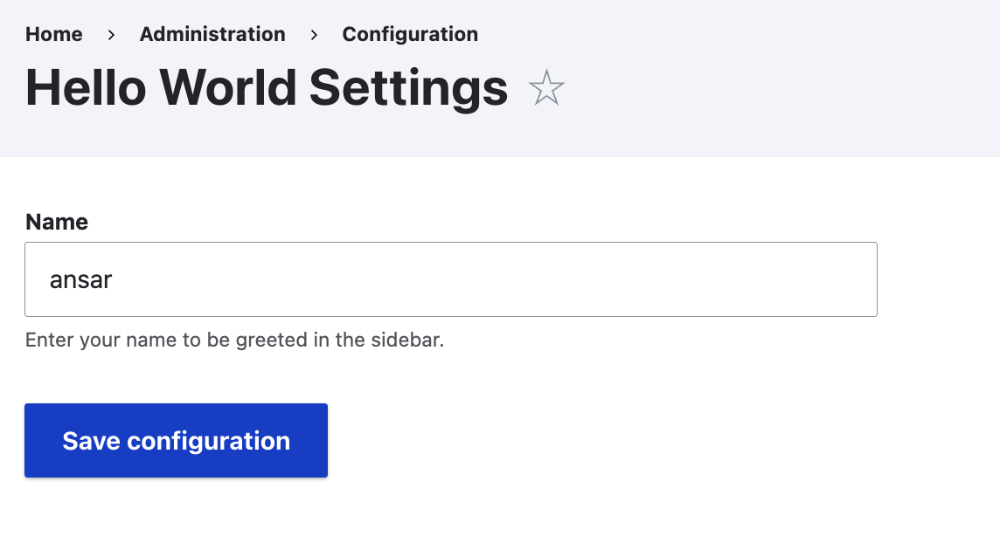
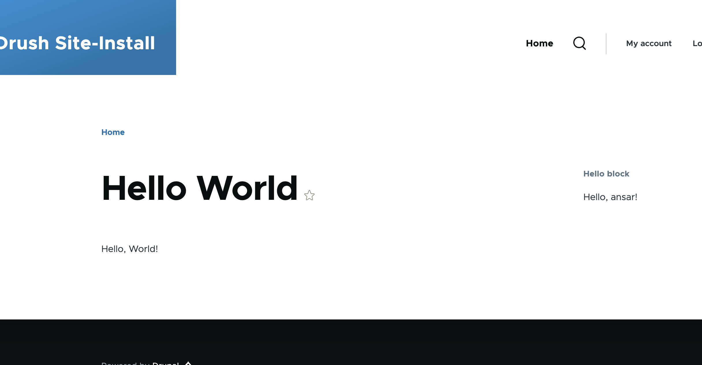
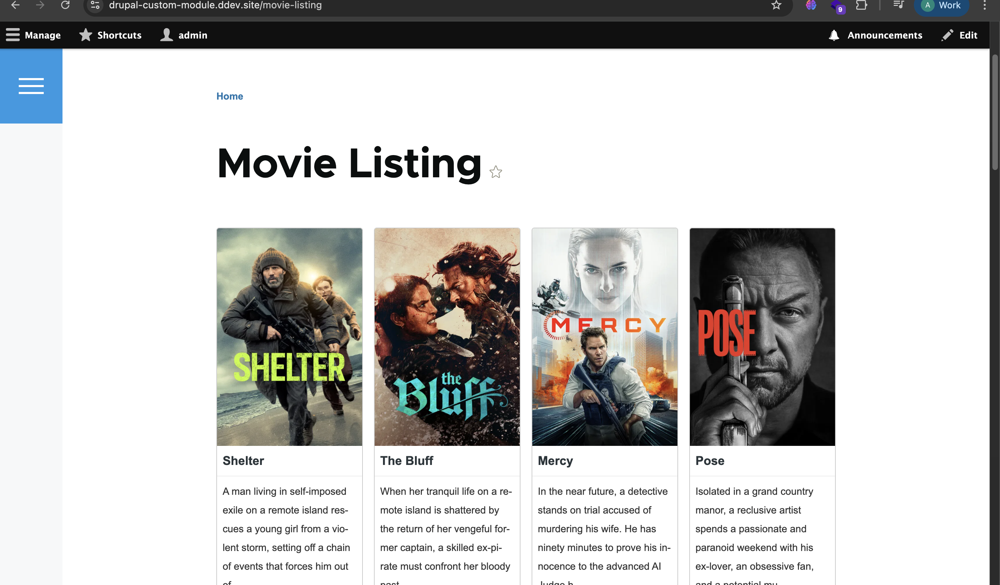
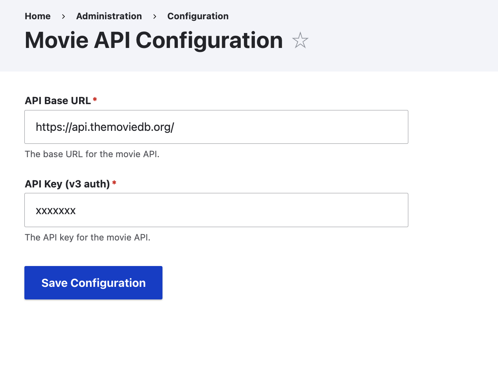

# Custom Modules

This directory contains the custom Drupal modules used in this project.

Modules included:

- **anytown**: A demo module showing a service, dependency injection, hooks and a controller that fetches weather data.
- **hello_world**: A minimal example module that provides a simple route, controller, block, and an admin settings form to set a name shown in the block.
- **movie_directory**: A custom module that integrates with a movie API to display a movie listing. It includes a service `MovieApiConnector`, a controller for the listing page, an admin configuration form for the API base URL and API key, and Twig templates for the listing and movie cards.

Quick overview:

- anytown
  - Provides a weather forecast page built around a custom `ForecastClient` service.
  - Demonstrates service registration, dependency injection, and use of hooks.
  - Files: `anytown.info.yml`, `anytown.routing.yml`, `anytown.links.menu.yml`, `anytown.services.yml`, `src/ForecastClient.php`, `src/ForecastClientInterface.php`, `src/Controller/WeatherController.php`, `src/Hook/AnytownTheme.php`, `src/Hook/FormHooks.php`, `templates/weather-page.html.twig`, plus associated CSS/JS assets.

- hello_world
  - Provides a simple page and a block that displays a greeting using the configured name.
  - Files: `hello_world.info.yml`, `hello_world.routing.yml`, `hello_world.links.menu.yml`, `src/Controller/HelloController.php`, `src/Form/HelloSettingsForm.php`, `src/Plugin/Block/HelloBlock.php`.

- movie_directory
  - Integrates with an external movie API, stores API configuration via an admin form, and renders a movie listing page with a set of cards.
  - Files: `movie_directory.info.yml`, `movie_directory.routing.yml`, `movie_directory.services.yml`, `movie_directory.module`, `src/MovieApiConnector.php`, `src/Controller/MovieListingController.php`, `src/Form/MovieApi.php`, `templates/movie-listing.html.twig`, `templates/movie-card.html.twig`, `assets/css/movie-styles.css`.

---

## hello_world

- Purpose: A minimal example module that demonstrates common Drupal extension points: a route/controller, a configurable admin form, and a block plugin.
- Key functionality:
  - Provides an admin settings form where an administrator can enter a name to be used by the module.
  - Exposes a simple page (via a controller) that can display content or links related to the module.
  - Provides a block plugin that reads the configured name and renders a greeting (for example, "Hello, ansar!").
- Main files and roles:
  - `hello_world.info.yml`: Module metadata used by Drupal.
  - `hello_world.routing.yml`: Declares any custom routes (pages) the module provides.
  - `hello_world.links.menu.yml`: Optionally adds menu links for the admin or site menus.
  - `src/Controller/HelloController.php`: Controller for the module's page routes.
  - `src/Form/HelloSettingsForm.php`: Configuration form that saves the greeting name to configuration storage.
  - `src/Plugin/Block/HelloBlock.php`: Block plugin that displays the stored name in a themed block.
- Usage:
  1. Enable the module: `drush en hello_world -y` or use the Extend UI.
  2. Visit Administration → Configuration → Hello World Settings to enter the name.
  3. Place the "Hello block" in a region through the Block Layout UI or visit the module's page route.

---

## movie_directory

- Purpose: Integrates with an external movie API to fetch and display movies in a styled listing.
- Key functionality:
  - Provides an admin configuration form to set the API base URL and API key.
  - Implements a service (`MovieApiConnector`) responsible for making HTTP requests to the remote movie API and returning parsed results.
  - Offers a controller (`MovieListingController`) which uses the service to fetch movies and passes data to Twig templates.
  - Contains Twig templates to render a responsive movie grid and individual movie cards.
  - Includes CSS in `assets/css/movie-styles.css` for card layout and styling.
- Main files and roles:
  - `movie_directory.info.yml`: Module metadata.
  - `movie_directory.routing.yml`: Defines the public route for the movie listing page.
  - `movie_directory.services.yml`: Registers the `MovieApiConnector` service and any other services.
  - `movie_directory.module`: Module hooks (if any) and lightweight integration code.
  - `src/MovieApiConnector.php`: Service that handles API requests and error handling.
  - `src/Controller/MovieListingController.php`: Controller that prepares data for the listing page.
  - `src/Form/MovieApi.php`: Admin form that stores `api_base_url` and `api_key` in configuration.
  - `templates/movie-listing.html.twig`: Page template for the full listing.
  - `templates/movie-card.html.twig`: Template for individual movie cards used by the listing.
  - `assets/css/movie-styles.css`: Styles for the movie grid and cards.
- Usage:
  1. Enable the module: `drush en movie_directory -y` or use the Extend UI.
  2. Visit Administration → Configuration → Movie API Configuration and provide your API base URL and API key.
  3. Visit the movie listing route (as defined in `movie_directory.routing.yml`) to see results.

---

## Screenshots

1. Hello World settings form
   

2. Hello World page and block
   

3. Movie listing page (grid)
   

4. Movie API Configuration form
   

---

## Usage (Quick Commands)

Enable both modules with Drush:

```bash
drush en hello_world movie_directory -y
```

Configure the modules via the administration UI:

- `Administration → Configuration → Hello World Settings` — set the greeting name.
- `Administration → Configuration → Movie API Configuration` — set the API base URL and API key.

---

## Day 2 — Routes, Controllers, Services & Dependency Injection

### How do you control or sort the menus?

Use `weight` in `MODULE_NAME.links.menu.yml`. Lower number = appears first, higher number = appears last.

```yaml
hello_world.admin:
  title: 'Hello module settings'
  parent: system.admin_config_development
  route_name: hello_world.content
  weight: 10 # appears before weight: 100
```

### How do you setup child menus?

Use `parent` and point it to the route name of the parent menu item.

```yaml
# Parent item
hello_world.admin:
  title: 'My Module'
  parent: system.admin_config
  route_name: system.admin_config_helloworld
  weight: 10

# Child item — points to parent above
hello_world.admin_settings:
  title: 'Settings'
  parent: system.admin_config_helloworld
  route_name: hello_world.content
  weight: 10
```

### How do you retrieve a query string in a Controller?

A query string is the `?key=value` part of a URL — not to confuse with a route parameter like `{id}`.

```
/movies?genre=action    → query string
/movies/42              → route parameter
```

```php
// URL: /movies?genre=action&year=2024
public function list() {
  $genre = \Drupal::request()->query->get('genre'); // "action"
  $year  = \Drupal::request()->query->get('year');  // "2024"
}
```

### What is Guzzle and Logger?

**Guzzle** is a PHP HTTP client — like `fetch()` in JavaScript. It lets you make HTTP requests to external APIs.

```php
// Make a GET request to an external API
$response = $this->httpClient->get('https://api.example.com/movies');
$data = json_decode($response->getBody()->getContents(), true);
```

**Logger** is Drupal's logging service. It lets you log messages from your module to the Drupal watchdog log, grouped by channel (module name).

```php
$this->logger->info('Page visited by @user', ['@user' => $name]);
$this->logger->error('API call failed: @msg', ['@msg' => $e->getMessage()]);
```

### Use Logger to log a message — where do messages appear?

```php
public function __construct(ClientInterface $httpClient, LoggerChannelFactoryInterface $logger_factory) {
    $this->httpClient = $httpClient;
    $this->logger = $logger_factory->get('anytown');
  }

...

public function getForecastData(string $url) : ?array {
    try {
      $response = $this->httpClient->request('GET', $url);
      $json = json_decode($response->getBody()->getContents());
    }
    catch (GuzzleException $e) {
      $this->logger->warning($e->getMessage());
      return NULL;
    }
    ....
}
```

Messages appear at: **Administration → Reports → Recent log messages**
(`/admin/reports/dblog`)

Filter by type `anytown` to see only your module's messages.

### Where can you find the services defined by Drupal core?

```
web/core/core.services.yml
```

This file lists all services Drupal core provides: `logger.factory`, `http_client`, `database`, `current_user`, `path_alias.manager`, and many more.

### How do you inject other needed services into your service?

Three ways, ranked best to avoid:

**1. AutowireTrait (recommended for Drupal 10/11)**

```php
use Drupal\Core\DependencyInjection\AutowireTrait;
use GuzzleHttp\ClientInterface;

class MyService {
  use AutowireTrait;

  public function __construct(
    private readonly ClientInterface $httpClient
  ) {}
}
```

**2. `create()` factory method (older, still valid)**

```php
public static function create(ContainerInterface $container) {
  return new static(
    $container->get('http_client'),
    $container->get('logger.factory')
  );
}

public function __construct($httpClient, $loggerFactory) {
  $this->httpClient = $httpClient;
  $this->logger = $loggerFactory->get('my_module');
}
```

**3. `services.yml` (for registering custom services)**

```yaml
# my_module.services.yml
services:
  my_module.my_service:
    class: Drupal\my_module\MyService
    arguments: ['@http_client', '@logger.factory']
```

### How do you return a Twig template in a Controller?

Three steps:

**Step 1 — Register the theme hook in `.module`:**

```php
// my_module.module
function my_module_theme() {
  return [
    'weather_forecast' => [
      'variables' => [
        'temperature' => NULL,
        'description' => NULL,
      ],
    ],
  ];
}
```

**Step 2 — Return render array with `#theme` in Controller:**

```php
public function content(): array {
  return [
    '#theme' => 'weather_forecast',
    '#temperature' => '25°C',
    '#description' => 'Sunny',
  ];
}
```

**Step 3 — Create Twig template:**

```twig
{# templates/weather-forecast.html.twig #}
<div class="weather">
  <p>{{ description }}</p>
  <p>Temperature: {{ temperature }}</p>
</div>
```

Rule: hook name uses `underscores` → filename uses `dashes` (`weather-forecast.html.twig`).

### How would you add an external JS to your module?

In `MODULE_NAME.libraries.yml`, use `type: external`:

```yaml
# anytown.libraries.yml
anytown-styles:
  js:
    https://unpkg.com/@tailwindcss/browser@4: { type: external }
  dependencies:
    - core/drupal
```

Then attach in your render array:

```php
return [
  '#theme' => 'weather_forecast',
  '#attached' => [
    'library' => ['anytown/anytown-styles'],
  ],
];
```

### Translation search keyword for `$this->t('Hello, @name!', ['@name' => $username])`

Search for the string **with the placeholder**, not the actual value:

```
Hello, @name!
```

Go to `/admin/config/regional/translate` and search `Hello, @name!` — Drupal stores the original string with the placeholder.

### How do you make a string translatable in Drupal JavaScript files?

Use `Drupal.t()` — the JavaScript equivalent of `$this->t()`:

```javascript
// Simple string
Drupal.t('Hello World');

// With placeholder
Drupal.t('Hello, @name!', { '@name': username });
```

Make sure your library has `core/drupal` as a dependency so `Drupal.t()` is available:

```yaml
my-library:
  js:
    js/my-script.js: {}
  dependencies:
    - core/drupal
```

### Use `drush php` to get the path alias of `node/1`

```bash
ddev drush php
```

Then inside the drush console:

```php
$alias_manager = \Drupal::service('path_alias.manager');
$alias = $alias_manager->getAliasByPath('/node/1');
echo $alias;
// Output: /my-page-alias  (or /node/1 if no alias is set)
```

**Get full URL of a route using `Link` and `Url`:**

```php
use Drupal\Core\Url;
use Drupal\Core\Link;

// Get URL object from route name
$url = Url::fromRoute('hello_world.content');

// Get the full URL string
$full_url = $url->setAbsolute(true)->toString();
echo $full_url;
// Output: https://drupal-custom-module.ddev.site/hello

// Create a clickable link
$link = Link::fromTextAndUrl('Go to Hello page', $url);
$renderable = $link->toRenderable();
```

### How do you send a JSON response in a Controller?

Use `JsonResponse` from Symfony — it automatically sets the `Content-Type: application/json` header:

```php
use Symfony\Component\HttpFoundation\JsonResponse;

public function apiData(): JsonResponse {
  $data = [
    'status' => 'ok',
    'movies' => [
      ['id' => 1, 'title' => 'Inception'],
      ['id' => 2, 'title' => 'Interstellar'],
    ],
  ];

  return new JsonResponse($data);
  // Automatically sets: Content-Type: application/json
  // Status code: 200 by default
}

// With custom status code
return new JsonResponse(['error' => 'Not found'], 404);
```

---

# Day 3 : Hooks

### What are hooks?

Hooks are **functions that run automatically to change or extend Drupal's behaviour**, and they have 3 types:

- **Registration hooks** : declare something exists (`hook_theme`, `hook_permission`)
- **Event hooks** : react to something that happened (`hook_user_login`, `hook_node_insert`)
- **Alter hooks** : intercept and modify data (`hook_form_alter`, `hook_preprocess_block`)

Two ways to implement in Drupal 11:

```php
// Modern way : OOP class in src/Hook/
#[Hook('form_alter')]
public function formAlter(array &$form, FormStateInterface $form_state, string $form_id): void {
  // logic here
}

// Old way : global function in .module file
function mymodule_form_alter(&$form, $form_state, $form_id) {
  // logic here
}
```

### What hooks does the `metatag` module provide?

Found in `web/modules/contrib/metatag/metatag.api.php`:

- `hook_metatag_route_entity` : tells metatag which entity to load tags from on a custom route
- `hook_metatags_attachments_alter` : modify metatags just before they are added to the page
- `hook_metatag_migrate_metatagd7_tags_map_alter` : used during migration from Drupal 7
- `hook_metatag_migrate_nodewordsd6_tags_map_alter` : used during migration from Drupal 6

### Which hook is responsible for altering a form?

`hook_form_alter` receives 3 arguments:

- `&$form` : the form array, passed by reference, modify directly
- `$form_state` : current state of the form
- `$form_id` : unique ID of the form being built

```php
// src/Hook/FormHooks.php
#[Hook('form_alter')]
public function formAlter(array &$form, FormStateInterface $form_state, string $form_id): void {
  if ($form_id === 'movie_api_config_page') {
    $form['my_custom_field'] = [
      '#type' => 'textfield',
      '#title' => 'My Custom Field',
      '#description' => 'Added by anytown module',
      '#weight' => 99,
    ];
  }
}
```

To find any form's ID temporarily add inside `formAlter`:

```php
\Drupal::messenger()->addMessage('Form ID: ' . $form_id);
```

### Using `isFrontPage` and a preprocess hook to pass `is_front` to Twig

`hook_preprocess_page` runs before `page.html.twig` renders : variables you add here become available in the template.

```php
// src/Hook/ThemeHooks.php
#[Hook('preprocess_page')]
public function preprocessPage(array &$variables): void {
  $variables['is_front'] = \Drupal::service('path.matcher')->isFrontPage();
}
```

Confirm it works temporarily:

```php
\Drupal::messenger()->addMessage('is_front = ' . ($variables['is_front'] ? 'TRUE' : 'FALSE'));
```

Use in Twig:

```twig

  <div class="hero-banner">Welcome!</div>

```

### Use `hook_page_attachments_alter` to add a viewport metatag

```php
// src/Hook/ThemeHooks.php
#[Hook('page_attachments_alter')]
public function pageAttachmentsAlter(array &$attachments): void {
  $attachments['#attached']['html_head'][] = [
    [
      '#tag' => 'meta',
      '#attributes' => [
        'name' => 'viewport',
        'content' => 'width=device-width, initial-scale=1, shrink-to-fit=no',
      ],
    ],
    'viewport',  // unique key : like an id, prevents duplicate tags
  ];
}
```

Verify : right click any page → View Page Source → search `viewport`.

### Use `hook_preprocess_menu` to add a CSS class to all menu items

```php
// src/Hook/ThemeHooks.php
#[Hook('preprocess_menu')]
public function preprocessMenu(array &$variables): void {
  foreach ($variables['items'] as &$item) {
    // $item['attributes'] is an Attribute object : use ->addClass() not array syntax
    $item['attributes']->addClass('my-custom-class');
  }
}
```

Verify by inspecting any menu `<li>` in browser dev tools.

### Use `hook_preprocess_block` to alter the `system_branding_block`

```php
// src/Hook/ThemeHooks.php
#[Hook('preprocess_block')]
public function preprocessBlock(array &$variables): void {
  if ($variables['plugin_id'] === 'system_branding_block') {
    $variables['site_logo'] = 'https://static.cdnlogo.com/logos/d/88/drupal-wordmark.svg';
  }
}
```

To find the `plugin_id` of any block, temporarily log all IDs:

```php
\Drupal::messenger()->addMessage('plugin_id: ' . $variables['plugin_id']);
```

This lists every block plugin ID when visiting a page : find the one you need and target it.
