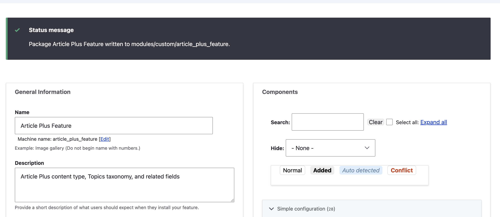
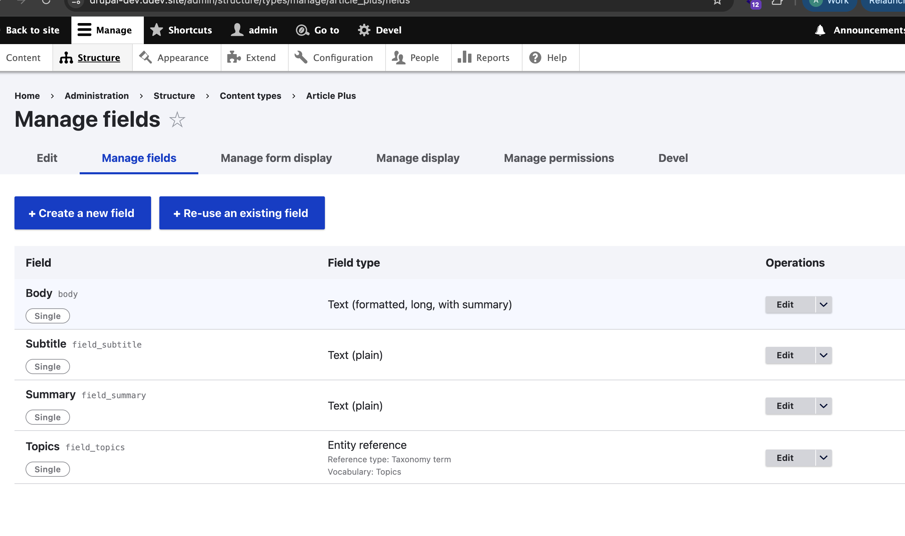
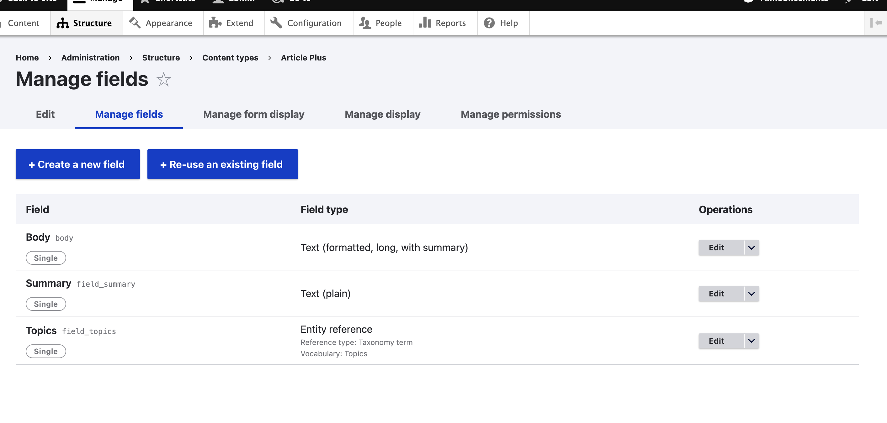
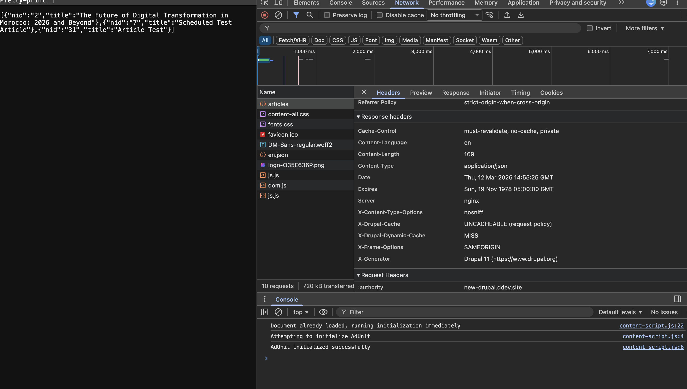
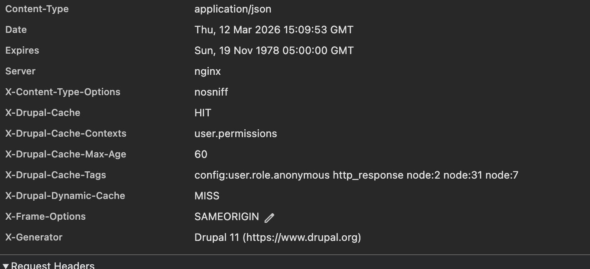

# Day 1: Work with Data (Entity & Field API, Configuration Entities)

## Password Policy Constraint

I installed the Password Policy module and its submodules using Composer and enabled them with Drush:

```bash
composer require 'drupal/password_policy:^4.0'
drush en password_policy password_policy_length password_policy_character_types password_policy_characters -y
```

I then created a policy and configured three constraints through the admin UI:


I implemented a custom validation constraint `PasswordPolicyConstraint` inside the `drupal_advanced` module and attached it to the `pass` field of the user entity using `hook_entity_base_field_info_alter`. The constraint validator injects the `password_policy.validator` service via `ContainerInjectionInterface` and runs the password through the active policies on every user save.

When a user registers or edits their account with a weak password, all three violations are shown:


## What is AccessResult and how does it work?

`AccessResult` is Drupal's object-oriented way of expressing access control decisions. It has three states: `allowed()`, `forbidden()`, and `neutral()`. Unlike raw booleans, every result carries cacheability metadata so Drupal knows how to vary and invalidate the page cache correctly. Results can be combined with `andIf()` and `orIf()`, and `forbidden()` always wins over `allowed()`.

## Scaffolding a Custom Entity

Generating a custom entity by hand involves a lot of boilerplate : entity class, routing, forms, handlers, and multiple YAML files. The fastest way is using Drush with Drupal Code Generator:

```bash
drush generate entity:content
drush generate entity:configuration
```

This generates everything wired together and ready to extend.

## Getting a Field Definition via Code

```php
$fields = \Drupal::service('entity_field.manager')
  ->getFieldDefinitions('node', 'article');

$definition = $fields['title'];
$definition->getType();
$definition->getLabel();
$definition->getSettings();
```

## Multiple Formatters for a Field Type

Yes, a field type and its formatters are fully decoupled. You can register as many formatters as you want for the same field type by pointing multiple `#[FieldFormatter]` plugins at the same `field_types` value. They all appear as options in the Manage Display UI. Drupal core already does this to the `text` field type ships with Default, Plain text, and Trimmed formatters out of the box.

## Retrieving Module Config via Drush

```bash
drush config:get mymodule.settings
drush config:get mymodule.settings some_key
drush config:edit mymodule.settings
```

# Day 2: Work with Hooks

## Adding a new base field to an existing entity type using `hook_entity_base_field_info`

This hook lets you add a new field to an existing entity type you don't own. It targets the entity type level, meaning the field is added to all bundles. If you only need it on one bundle, use `hook_entity_bundle_field_info` instead.

```php
function drupal_advanced_entity_base_field_info(EntityTypeInterface $entity_type): array {
  $fields = [];

  if ($entity_type->id() === 'node') {
    $fields['drupal_advanced_subtitle'] = BaseFieldDefinition::create('string')
      ->setLabel(t('Subtitle'))
      ->setDisplayOptions('form', [
        'type' => 'string_textfield',
        'weight' => -4,
      ])
      ->setDisplayConfigurable('form', TRUE)
      ->setDisplayConfigurable('view', TRUE);
  }

  return $fields;
}
```

After adding this, run `drush updb` to create the column in the database.

## What is the role of `hook_update_n`

It runs a one-time update on an already installed module. Drupal tracks which updates have run so it never runs the same one twice. Think of it like a database migration.

The number follows this structure: `[major_version][schema_version][sequential_number]`

```
hook_update_10001
  10 → Drupal 10
  0  → module schema version
  01 → first update
```

```php
/**
 * Add subtitle field to node table.
 */
function drupal_advanced_update_10001(): void {
  $field = BaseFieldDefinition::create('string')
    ->setLabel(t('Subtitle'));

  \Drupal::entityDefinitionUpdateManager()
    ->installFieldStorageDefinition(
      'drupal_advanced_subtitle',
      'node',
      'drupal_advanced',
      $field
    );
}
```

```bash
drush updb          # run all pending updates
drush updb --no     # preview without running
```

## What is the role of `hook_install`

Runs once when the module is first enabled. Used for one-time setup like creating default config, inserting initial data, or setting up default terms.

```php
function drupal_advanced_install(): void {
  \Drupal::configFactory()
    ->getEditable('drupal_advanced.settings')
    ->set('enabled', TRUE)
    ->save();
}
```

```
drush en drupal_advanced  → hook_install runs once, never again
drush updb                → hook_update_n runs for any updates Drupal hasn't seen yet
```

```
hook_install    → building the house before anyone moves in
hook_update_n   → renovating the house while people are still living in it
```

## Prefixing all newly created article nodes with `HEY-` using `hook_ENTITY_TYPE_presave`

`presave` fires right before the entity hits the database so you can modify values before they are saved. `$node->isNew()` ensures the prefix is only added on creation, not on every update.

```php
function drupal_advanced_node_presave(NodeInterface $node): void {
  if ($node->isNew() && $node->getType() === 'article') {
    $current_title = $node->getTitle();

    if (!str_starts_with($current_title, 'HEY-')) {
      $node->setTitle('HEY-' . $current_title);
    }
  }
}
```

The full entity lifecycle:

```
presave  → before DB  → can still modify entity
insert   → after DB   → new entity, cannot modify
update   → after DB   → existing entity, cannot modify
delete   → before DB  → entity being deleted
```

## What is the role of `$entity->original`

When an entity is updated, Drupal loads the previous version from the database and attaches it as `$entity->original`. This lets you compare old and new values. It is `NULL` on new entities so always check `!$entity->isNew()` first.

```php
function drupal_advanced_node_presave(NodeInterface $node): void {
  if (!$node->isNew() && $node->original) {
    $old_title = $node->original->getTitle();
    $new_title = $node->getTitle();

    if ($old_title !== $new_title) {
      \Drupal::logger('drupal_advanced')
        ->info('Title changed from @old to @new', [
          '@old' => $old_title,
          '@new' => $new_title,
        ]);
    }
  }
}
```

```
new entity    → $entity->original is NULL
update        → $entity->original has the old data
```

Available in both `presave` and `update` hooks.

## How to override a Theme Hook provided by another module

Drupal has a strict priority order:

```
active theme   → always wins
custom module  → wins over contrib
contrib module → lowest priority
```

The simplest way is to create a template with the same name in your active theme, no code needed:

```
mytheme/
  templates/
    user.html.twig   ← Drupal picks this, ignores the module's version
```

To override from a module instead of a theme, use `hook_theme_registry_alter` to point Drupal to your module's templates folder:

```php
function drupal_advanced_theme_registry_alter(array &$theme_registry): void {
  if (isset($theme_registry['user'])) {
    $theme_registry['user']['path'] = \Drupal::service('extension.list.module')
      ->getPath('drupal_advanced') . '/templates';
  }
}
```

## Adding a theme suggestion for `user` based on view mode using `hook_theme_suggestions_alter`

Theme suggestions tell Drupal to look for a more specific template before falling back to the default. This lets you have a different template per view mode without touching the original.

```php
function drupal_advanced_theme_suggestions_alter(
  array &$suggestions,
  array $variables,
  string $hook
): void {
  if ($hook === 'user') {
    $view_mode = $variables['elements']['#view_mode'] ?? 'full';
    $suggestions[] = 'user__' . $view_mode;
  }
}
```

Then create the templates in your active theme:

```
mytheme/
  templates/
    user.html.twig            ← default fallback
    user--teaser.html.twig    ← used only in teaser mode
    user--full.html.twig      ← used only in full mode
```

The naming convention:

```
suggestion: user__teaser   → filename: user--teaser.html.twig
             __ = --
```

How it flows:

```
user rendered in teaser mode
  → suggestion user__teaser added
  → Drupal looks for user--teaser.html.twig
  → found → uses it
  → not found → falls back to user.html.twig
```

This same pattern works for any use case for example switching layout based on a query string:

```
/content?type=grid    → node--grid.html.twig
/content?type=list    → node--list.html.twig
/content?type=columns → node--columns.html.twig
```

```bash
drush cr   # always clear cache after adding new templates
```

# Day 3: Work with Configuration & Features

## Setting up two Drupal instances

I created two separate Drupal 11 instances locally using DDEV, one acting as dev and one acting as prod. The setup steps are the same for both, just with different project names.

```bash
mkdir ~/dev/drupal-dev && cd ~/dev/drupal-dev
ddev config --project-type=drupal --project-name=drupal-dev
ddev start
ddev composer create drupal/recommended-project .
ddev config --docroot=web
ddev restart
ddev drush site:install standard --db-url=mysql://db:db@db/db --account-name=admin --account-pass=admin --account-mail=admin@admin.com -y
ddev drush cr
```

The `--docroot=web` step is important. When Composer creates a Drupal project it puts all Drupal files inside a `web/` subfolder. Without telling DDEV where to look, nginx serves from the wrong folder and returns a 403 Forbidden.

Both sites running:

```
NAME         STATUS        URL
drupal-dev   running (ok)  https://drupal-dev.ddev.site
drupal-prod  running (ok)  https://drupal-prod.ddev.site
```

## Changing the site name

The default site name after a drush install is "Drush Site-Install". Changed it with:

```bash
ddev drush config:set system.site name "Drupal Dev" -y
ddev drush cr
```

## Installing Coffee

Coffee is an admin navigation module that lets you quickly jump to any admin page using `Alt + D`. Installed in both environments:

```bash
ddev composer require drupal/coffee
ddev drush en coffee -y
```

---

## Dev environment setup

All of the following was done only in the dev environment.

### Install Devel

```bash
cd ~/dev/drupal-dev
ddev composer require drupal/devel
ddev drush en devel -y
```

### Create a Taxonomy vocabulary

Created a vocabulary called `Topics` at `Structure > Taxonomy > Add vocabulary` with terms: Technology, Science, Business.

### Create a Content type

Created a content type called `Article Plus` at `Structure > Content types > Add content type` with the following fields:

```
body          → reused existing body field
field_summary → text plain
field_topics  → entity reference > taxonomy term > Topics vocabulary
```

### Create a Role and set permissions

Created a role called `Article Editor` at `People > Roles > Add role`. Then configured permissions so only users with this role can manage Article Plus content:

```
Article Plus: Create new content    ✅
Article Plus: Edit own content      ✅
Article Plus: Delete own content    ✅
```

---

## Configuration Sync with Config Split

The goal was to export all dev configuration and import it into prod. The problem is that devel is a dev-only tool and should never be installed in prod.

First attempt without config_split failed with:

```
Unable to install the devel module since it does not exist.
```

This confirmed the sprint question without config_split, devel config gets included in the export and breaks the prod import.

**Answer: Yes, devel would have been installed in prod without config_split. That is the problem it solves.**

Installed config_split in dev and created a Development split:

```bash
ddev composer require drupal/config_split:^2.0
ddev drush en config_split -y
```

Created the split at `Configuration > Config Split > Add` with:

```
Label   : Development
Folder  : ../config/dev
Modules : devel
```

Created the folder:

```bash
mkdir -p config/dev
```

Exported again devel config moved to the dev split folder and out of the main sync:

```bash
ddev drush config:export -y
```

The export confirmed:

```
devel.settings          → Delete (removed from main sync)
devel.toolbar.settings  → Delete (removed from main sync)
system.menu.devel       → Delete (removed from main sync)
```

One-time setup steps needed before importing into a fresh prod site:

```bash
# match prod UUID to dev
cd ~/dev/drupal-prod
ddev drush config:set system.site uuid "a05208b5-6e8a-4b08-8ca5-f720fe0bad76" -y

# install config_split code in prod (not enabled, just available)
ddev composer require drupal/config_split:^2.0
```

Copied the main sync folder from dev to prod and imported:

```bash
cp -r ~/dev/drupal-dev/web/sites/default/files/config_.../sync/. \
      ~/dev/drupal-prod/web/sites/default/files/sync/

cd ~/dev/drupal-prod
ddev drush config:import -y
ddev drush cr
```

Import succeeded. Verified in prod:

```
Structure > Content types  → Article Plus ✅
Structure > Taxonomy       → Topics vocabulary ✅
People > Roles             → Article Editor ✅
Extend                     → devel NOT installed ✅
```

---

## Features

### Goal

Export only the Article Plus content type, Topics taxonomy, fields, and the Article Editor role as a self-contained Drupal module using the Features module. This allows deploying specific config pieces independently of a full config sync.

---

### Install Features in dev (with features_ui)

```bash
cd ~/dev/drupal-dev
ddev composer require drupal/features drupal/config_update
ddev drush en features features_ui -y
ddev drush cr
```

> `features_ui` provides the browser UI for building feature packages. It is installed in dev only, prod will only have the base `features` module.

---

### Create the feature module via the UI

Go to: `https://drupal-dev.ddev.site/admin/config/development/features`

Click **+ Create new feature** and fill in:

```
Name        : Article Plus Feature
Machine name: article_plus_feature
Description : Article Plus content type, Topics taxonomy, and related fields
```

In the **Components** panel, expand each section and check:

```
Content type        → Article Plus (article_plus)
Entity form display → node.article_plus.default
Entity view display → node.article_plus.default
                      node.article_plus.teaser
Field               → Body, Summary, Topics
Field storage       → node.field_summary
                      node.field_topics
Role                → Article Editor (article_editor)
Taxonomy vocabulary → Topics (topics)
```

Click **Write** to write the module directly to `modules/custom/`.



Verify the module was created:

```bash
ls ~/dev/drupal-dev/web/modules/custom/article_plus_feature/config/install/
```

```
core.entity_form_display.node.article_plus.default.yml
core.entity_view_display.node.article_plus.default.yml
core.entity_view_display.node.article_plus.teaser.yml
field.field.node.article_plus.body.yml
field.field.node.article_plus.field_summary.yml
field.field.node.article_plus.field_topics.yml
field.storage.node.field_summary.yml
field.storage.node.field_topics.yml
node.type.article_plus.yml
taxonomy.vocabulary.topics.yml
user.role.article_editor.yml
```

---

### Copy the module to prod

```bash
mkdir -p ~/dev/drupal-prod/web/modules/custom
cp -r ~/dev/drupal-dev/web/modules/custom/article_plus_feature \
      ~/dev/drupal-prod/web/modules/custom/
```

---

### Install Features in prod — without features_ui

```bash
cd ~/dev/drupal-prod
ddev composer require drupal/features drupal/config_update
ddev drush en features -y
# features_ui is intentionally NOT enabled in prod
ddev drush cr
```

---

### Enable the feature module in prod via Drush

```bash
ddev drush en article_plus_feature -y
ddev drush cr
```

Verify:

```bash
ddev drush pml | grep article_plus_feature
# Article Plus Feature  Enabled

ddev drush features-list-packages | grep article_plus
# Article Plus Feature   article_plus_feature   Installed
```

---

### Edit the content type name in prod (simulate config drift)

```bash
ddev drush config:set node.type.article_plus name "Article Plus PROD EDIT" -y
ddev drush cr
```

This simulates a real-world scenario where someone edits config directly in prod creating a divergence from what the feature defines.

---

### Add a new field in dev and re-export

In dev, go to `Structure > Content types > Article Plus > Manage fields > Add field`:

```
Field type  : Text (plain)
Label       : Subtitle
Machine name: field_subtitle
```

Dev now has the `field_subtitle` field:



Re-export the feature via the UI make sure to check the new `Subtitle` field and `node.field_subtitle` field storage, then click **Write** again.

Or via Drush:

```bash
cd ~/dev/drupal-dev
ddev drush features-export article_plus_feature -y
```

Copy the updated module to prod:

```bash
cp -r ~/dev/drupal-dev/web/modules/custom/article_plus_feature \
      ~/dev/drupal-prod/web/modules/custom/
```

Check for conflicts in prod before importing:

```bash
cd ~/dev/drupal-prod
ddev drush features-list-packages
```

```
Article Plus Feature   article_plus_feature   Installed    Changed  ⚠️
```

The `Changed` state confirms Features detected that prod config (`node.type.article_plus` name was edited) has drifted from what the feature defines.

---

### Import the feature in prod — resolve the conflict

```bash
ddev drush features-import article_plus_feature -y
ddev drush cr
```

Features imports by overwriting active config with the feature's version the prod name edit is reverted and the new `field_subtitle` is added.

Verify the conflict was resolved and the new field exists:

```bash
ddev drush ev "echo \Drupal::entityTypeManager()->getStorage('node_type')->load('article_plus')->label();"
# Article Plus  ← prod name edit was overwritten, conflict resolved

ddev drush ev "\$f = \Drupal::entityTypeManager()->getStorage('field_config')->load('node.article_plus.field_subtitle'); echo \$f ? 'EXISTS' : 'NOT FOUND';"
# EXISTS
```

Prod content type fields before import : `field_subtitle` is not present:



Prod content type fields after import : `field_subtitle` is now present:


---

### Question: Were there any conflicts that needed to be resolved?

**Yes.**

When the content type name was changed directly in prod to "Article Plus PROD EDIT" and the feature was then updated and re-imported, Features flagged the package state as `Changed` meaning prod config had drifted from what the feature defines.

Running `ddev drush features-import article_plus_feature` resolved the conflict by reverting prod to the feature's version:

- The name "Article Plus PROD EDIT" was overwritten back to "Article Plus"
- The new `field_subtitle` field was added cleanly with no conflict

**Key lesson:** Features _owns_ the config it exports. Any manual changes in prod to config that belongs to a feature will be flagged as `Changed` on the next import and overwritten. If a prod change needs to persist, it must be made in dev, captured in the feature, and re-deployed never edited directly in prod.

---

### Drush commands reference

| Command                          | What it does                                       |
| -------------------------------- | -------------------------------------------------- |
| `drush features-list-packages`   | List all features and their state                  |
| `drush features-status <module>` | Detailed status for one feature                    |
| `drush features-export <module>` | Re-export a feature from active config             |
| `drush features-import <module>` | Import feature into active config (resolves drift) |
| `drush features-diff <module>`   | Show diff between feature and active config        |

# Day 4: Work with Cache

Ref: https://drupalize.me/tutorial/concept-caching?p=3244

## Part 1: ForecastClient cache debugging

### The service

The `anytown` module has a `ForecastClient` service that fetches weather forecast data from a remote JSON endpoint and caches the result using `cache.default`.

### `anytown.services.yml`

```yaml
services:
  anytown.forecast_client:
    class: Drupal\anytown\ForecastClient
    arguments: ['@http_client', '@logger.factory', '@cache.default']
  Drupal\anytown\ForecastClientInterface:
    alias: anytown.forecast_client
```

### `ForecastClient.php`

```php
public function getForecastData(string $url, $reset_cache = false) : ?array {
  $cache_id = 'anytown_forecast:' . md5($url);
  $data = $this->cache->get($cache_id);

  if ($data && !$reset_cache) {
    $forecast = $data->data;
  } else {
    try {
      $response = $this->httpClient->request('GET', $url);
      $json = json_decode($response->getBody()->getContents());
    }
    catch (GuzzleException $e) {
      $this->logger->warning($e->getMessage());
      return NULL;
    }

    $forecast = [];
    foreach ($json->list as $day) {
      $forecast[$day->day] = [
        'weekday'     => ucfirst($day->day),
        'description' => $day->weather[0]->description,
        'high'        => $this->kelvinToFahrenheit($day->main->temp_max),
        'low'         => $this->kelvinToFahrenheit($day->main->temp_min),
        'icon'        => $day->weather[0]->icon,
      ];
    }

    $this->cache->set($cache_id, $forecast, strtotime('+1 hour'));
  }

  return $forecast;
}
```

### Adding caching to ForecastClient

Implemented caching in `getForecastData` using `cache.default` on the first request the data is fetched from the remote API and stored in cache for 1 hour. Subsequent requests return the cached data directly without hitting the API.

### Issue encountered

After implementing caching, every page refresh was still a cache miss. The issue was in `WeatherController` the location config value was being appended directly to the JSON filename:

```php
// WeatherController.php this was the problem
// Produced: weather_forecast.json12345 → 404 → GuzzleException → return NULL
// cache->set() was never reached because the HTTP request failed

// if ($location) {
//   $url = $url . strtolower($location);
// }
```

The broken URL caused a 404, Guzzle threw an exception, the catch block returned `NULL` `cache->set()` was never reached. Commenting out the location append fixed it and caching worked correctly.

## Part 2: /api/articles endpoint

### Route `drupal_advanced.routing.yml`

```yaml
drupal_advanced.article_api:
  path: '/api/articles'
  defaults:
    _controller: '\Drupal\drupal_advanced\Controller\ArticleApiController::getArticles'
    _title: 'Article API'
  requirements:
    _permission: 'access content'
```

### Controller `src/Controller/ArticleApiController.php`

```php
<?php

declare(strict_types=1);

namespace Drupal\drupal_advanced\Controller;

use Drupal\Core\Cache\CacheableJsonResponse;
use Drupal\Core\Cache\CacheableMetadata;
use Drupal\Core\Controller\ControllerBase;

class ArticleApiController extends ControllerBase {

  const NODE_IDS = [2, 7, 31];

  public function getArticles(): CacheableJsonResponse {
    $storage = $this->entityTypeManager()->getStorage('node');
    $data = [];

    foreach (self::NODE_IDS as $nid) {
      /** @var \Drupal\node\NodeInterface $node */
      $node = $storage->load($nid);
      if ($node) {
        $data[] = [
          'nid'   => (int) $node->id(),
          'title' => $node->getTitle(),
        ];
      }
    }

    $response = new CacheableJsonResponse($data);

    $cache = new CacheableMetadata();
    $cache->setCacheMaxAge(60);
    // Only declare tags for the specific nodes we care about.
    // node_list is not needed here since our list is static/hardcoded.
    $cache->setCacheTags(['node:2', 'node:7', 'node:31']);
    $response->addCacheableDependency($cache);

    return $response;
  }
}
```

### Endpoint response



```json
[
	{
		"nid": "2",
		"title": "The Future of Digital Transformation in Morocco: 2026 and Beyond"
	},
	{ "nid": "7", "title": "Scheduled Test Article" },
	{ "nid": "31", "title": "Article Test" }
]
```

## Part 3: max-age caching

Set `setCacheMaxAge(60)` the response is cached for 60 seconds.

**Test:** edited node 31's title and immediately hit the endpoint again.

**Result:** the old title was still returned. The cache had no awareness of the content change it only expires after 60 seconds regardless of edits.

**Answer: No, the data does not refresh instantly with max-age.**

## Part 4: cache tags

Added cache tags one per node:

```php
$cache->setCacheTags(['node:2', 'node:7', 'node:31']);
```

When Drupal saves a node it automatically invalidates the matching `node:X` tag. Any cached response that declared a dependency on that tag is immediately marked stale and rebuilt on the next request.

**Test:** edited node 31's title and immediately hit the endpoint.

**Result:** the new title appeared instantly.

**Answer: Yes, the data refreshes instantly with cache tags.**

### Why not add `node_list`?

`node_list` is invalidated when any node is **created or deleted** not on edit. Since our list is hardcoded to `[2, 7, 31]`, we don't care about new nodes being created. The individual `node:X` tags are sufficient.

`node_list` would be essential for dynamic queries like "get the latest 3 articles" where creating a new node would change the results.

## Part 5: inspecting cache tags via response headers

By setting `http.response.debug_cacheability_headers: true` in `sites/development.services.yml` and loading it via `settings.local.php`, Drupal exposes cache metadata as HTTP response headers on every request.

```yaml
# sites/development.services.yml
parameters:
  http.response.debug_cacheability_headers: true
```

```php
// sites/default/settings.local.php
$settings['container_yamls'][] = DRUPAL_ROOT . '/sites/development.services.yml';
```

Inspect them in **browser DevTools → Network tab → select the request → Response Headers**:



```
X-Drupal-Cache:          HIT
X-Drupal-Cache-Tags:     config:user.role.anonymous http_response node:2 node:31 node:7
X-Drupal-Cache-Contexts: user.permissions
X-Drupal-Cache-Max-Age:  60
```

This tells you exactly which tags the cached response depends on useful for verifying your caching is configured correctly without reading the source code.

> `development.services.yml` is **dev only**. It is loaded via `settings.local.php` which is never committed to git and never exists on production.
