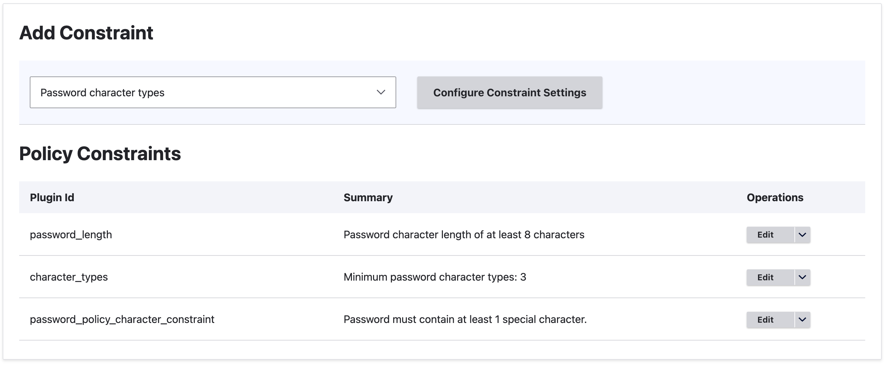
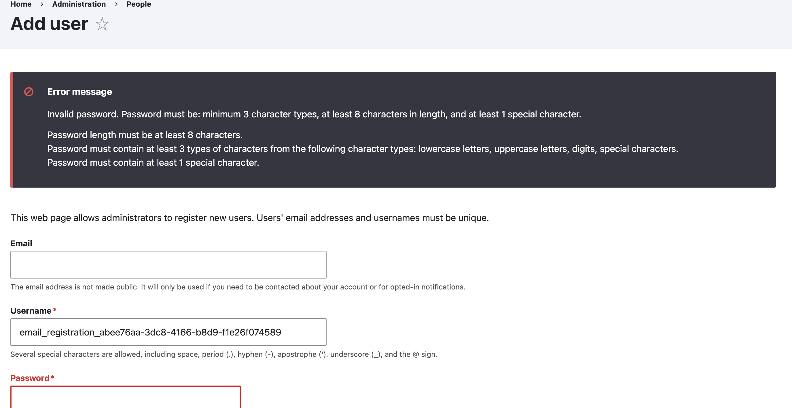

# Day 1: Work with Data (Entity & Field API, Configuration Entities)

## Password Policy Constraint

I installed the Password Policy module and its submodules using Composer and enabled them with Drush:

```bash
composer require 'drupal/password_policy:^4.0'
drush en password_policy password_policy_length password_policy_character_types password_policy_characters -y
```

I then created a policy and configured three constraints through the admin UI:



I implemented a custom validation constraint `PasswordPolicyConstraint` inside the `drupal_advanced` module and attached it to the `pass` field of the user entity using `hook_entity_base_field_info_alter`. The constraint validator injects the `password_policy.validator` service via `ContainerInjectionInterface` and runs the password through the active policies on every user save.

When a user registers or edits their account with a weak password, all three violations are shown:



## What is AccessResult and how does it work?

`AccessResult` is Drupal's object-oriented way of expressing access control decisions. It has three states: `allowed()`, `forbidden()`, and `neutral()`. Unlike raw booleans, every result carries cacheability metadata so Drupal knows how to vary and invalidate the page cache correctly. Results can be combined with `andIf()` and `orIf()`, and `forbidden()` always wins over `allowed()`.

## Scaffolding a Custom Entity

Generating a custom entity by hand involves a lot of boilerplate — entity class, routing, forms, handlers, and multiple YAML files. The fastest way is using Drush with Drupal Code Generator:

```bash
drush generate entity:content
drush generate entity:configuration
```

This generates everything wired together and ready to extend.

## Getting a Field Definition via Code

```php
$fields = \Drupal::service('entity_field.manager')
  ->getFieldDefinitions('node', 'article');

$definition = $fields['title'];
$definition->getType();
$definition->getLabel();
$definition->getSettings();
```

## Multiple Formatters for a Field Type

Yes, a field type and its formatters are fully decoupled. You can register as many formatters as you want for the same field type by pointing multiple `#[FieldFormatter]` plugins at the same `field_types` value. They all appear as options in the Manage Display UI. Drupal core already does this — the `text` field type ships with Default, Plain text, and Trimmed formatters out of the box.

## Retrieving Module Config via Drush

```bash
drush config:get mymodule.settings
drush config:get mymodule.settings some_key
drush config:edit mymodule.settings
```
